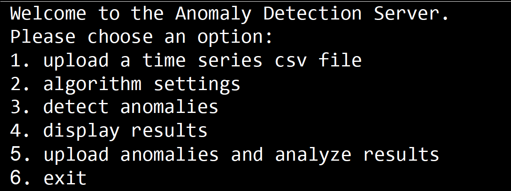

# Anomaly Detector Project

### About the project:
* The project write in c++
* The projects is a anomaly detector for anomaly flying data
* The Detector is base on simple statistic algorithm - creat 

### About the Detector:
* the detector creat a linear regression model for each sensor data of the flying data
* It's contain 2 steps:
    * step 1: creat a model for each sensor data "train mode" 
    * step 2: detect the anomaly of the flying data when given a csv file of the data flying
    * display the result of the  anomaly detection

### How it works:
1. Server start and listen to the port waiting for the client to connect
2. Client send the csv "time series" file of the data flying to the server to "train" the model
3. The server creat  a model (linear regression) for each sensor data of the data flying
4. The clien sent the csv "time series" file of the data flying to the server to "detect" the anomaly of the data flying
5. The server send the result of the detection to the client if the clien ask for it

#### About the csv file:
* The csv file must have the following format:
    * the first row is the name fo the cloumn name (the sensor name)
    * the next row the data of the sensor in the time series (the csv file)
    * the end of the  csv must end with new line contain "done"
#### For exmple:

 A,B,C,D,E,F,G,H 

26,114.33,7,120.21,-1.14715,-1.6383,19,-45 

 31,134.02,27,520.32,-13.8956,-1.70617,77,63
 

.. 
 

done
 

### The menu  of the server:
1. Press 1 - the client need to upload the csd to the train mode, and after that the csv for the detect mode
2. Press 2 - the server will display the current correlation threshold, and the clien can change its ( the correlation can be bewteen 0 and 1)
3. Press 3 - the server will run to detect algorithm  on the csv file that uploaded before.
4. Press 4 - the server will display the detection result
5. Press 5 - this is feature is to test the algoritm, the clien will upload list of anomaly that there in the csv file, 
6. And the server will display True positive rate (how much of the reports of the anomalys were true) and False alarm rate (how much of the reports were false)

### About the server:
* The server will lesten to port 3000 and will wait for the client to connect
* When client connect, the server will open new thread to handle the client request

